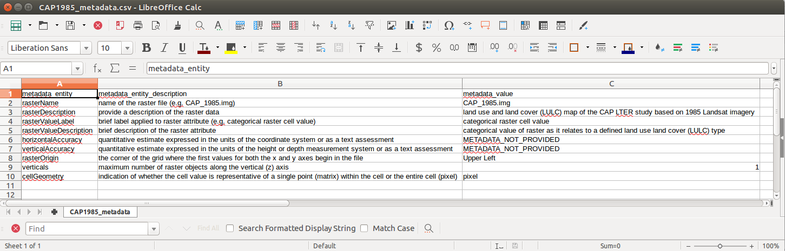
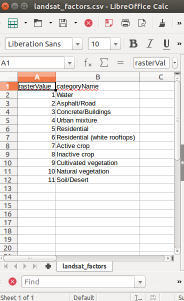

For each raster, generate a separate metadata file to detail critical information about the raster. 

 

If the raster values are categorical, generate a metadata file to catalog the unique raster value categories and their meaning. Additional metadata about the categories can be provided at the data set level.


 


Call the create_spatialRaster function to generate the EML to describe the raster.
```{r, eval=FALSE}
cap1985 <- create_spatialRaster('~/knb-lter-cap.650.1/CAP 30m Landsat Series Submit/',
                                '~/knb-lter-cap.650.1/rasterMetadataFiles/CAP1985_metadata.csv',
                                '~/knb-lter-cap.650.1/rasterMetadataFiles/landsat_factors.csv')
```

